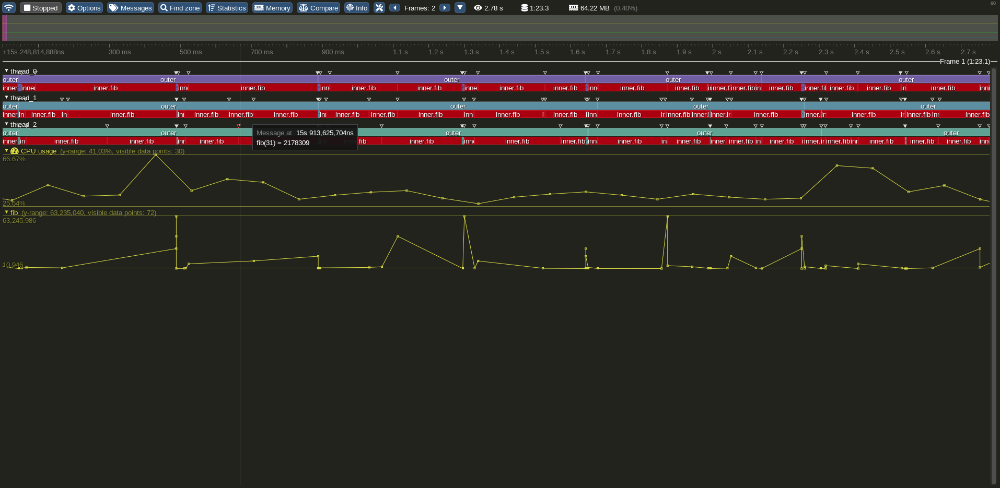

# OCaml-tracy

This repo contains bindings to [Tracy](https://github.com/wolfpld/tracy),
a profiler and trace visualizer. It's licensed, like Tracy, under
BSD-3-Clause.

The bindings are pretty basic and go through the C API, not the C++ one (RAII is
not compatible with having a function call to enter, and one to exit).

It depends on a C++ compiler to build, along with the dependencies
of Tracy-client.

## Feature table

| feature | supported |
|------|---|
| zones | ✔ |
| messages | ✔ |
| plots | ✔ |
| locks | ❌ |
| screenshots | ❌ |
| frames | ❌ |
| gpu | ❌ |

In some cases the feature might not provide all options.

## Example

The file `examples/prof1.ml` shows basic instrumentation on a program that computes
the Fibonacci function (yes, not representative) in a loop on 3 threads.
If Tracy is running and is waiting for a connection (press "connect"),
running `dune exec ./examples/prof1.exe` should start tracing
and display something like this: 
